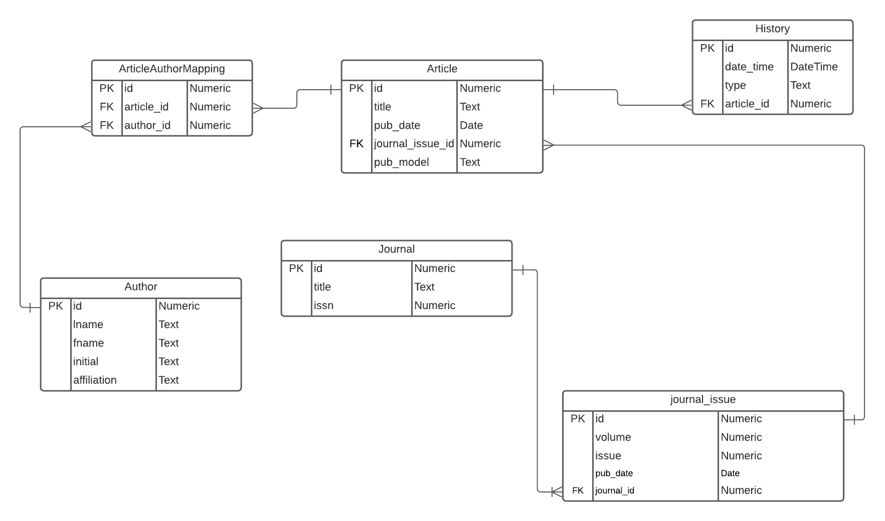
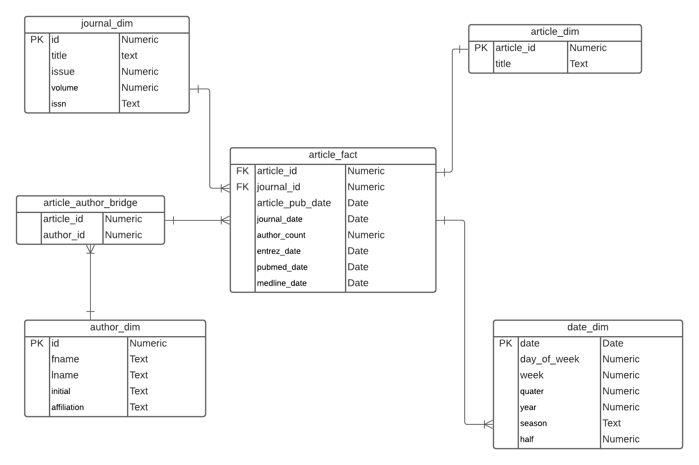
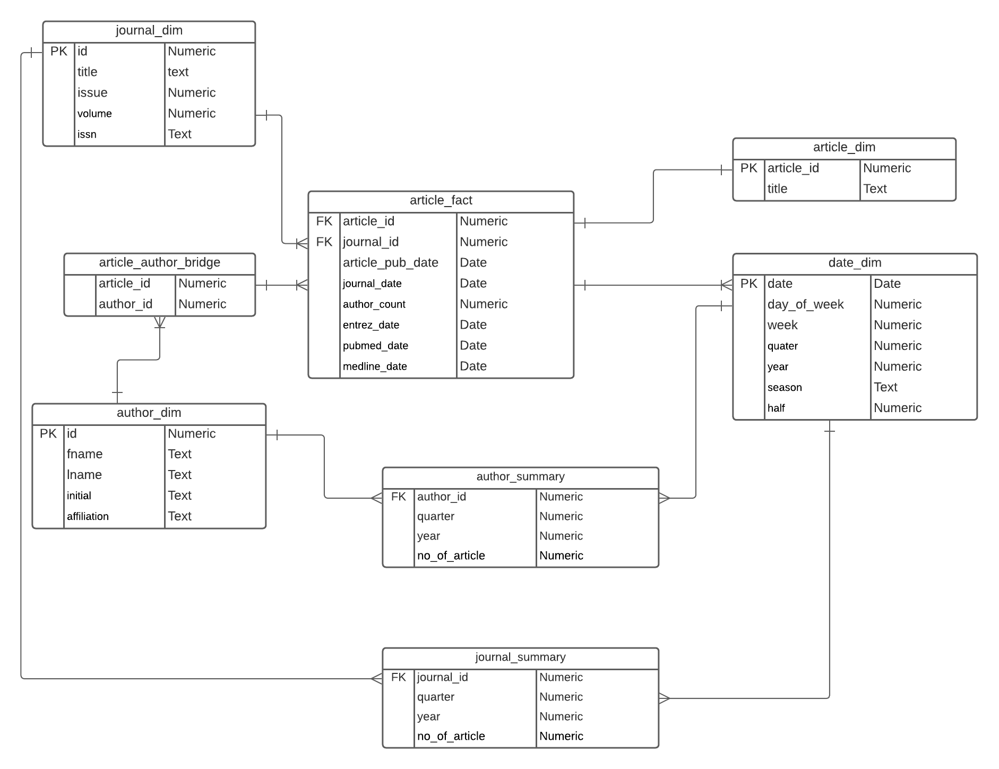

# Part 1. ERD showing OLTP schema


```{r}
# Importing required libraries

if("RMySQL" %in% rownames(installed.packages()) == FALSE) {
  install.packages("RMySQL")
}
library(RMySQL)

if("XML" %in% rownames(installed.packages()) == FALSE) {
  install.packages("XML")
}
library(XML)
library(stringr)
library(dplyr)
```

## Support Functions

#### Function: insertIntoTable
Inserts the given data frame into the given table.

```{r insertIntoTable}
insertIntoTable <- function(table, df) {
  # Create chunks of 1000 rows
  cols <- paste0(colnames(df),collapse = ",")
  df <- split(df, ceiling(seq_along(df)/1000))
  for(chunk in df){
    vals <- paste0(apply(chunk, 1, function(x) paste0("('", paste0(trimws(x), collapse = "', '"), "')")), collapse = ", ")

    query <- paste("INSERT INTO ",table,"(",cols,") VALUES",str_replace_all(vals, "'NA'", "NULL"),";")
  
    dbGetQuery(dbcon, query);
  }
}
```

#### Function: parsePubDate
Returns a parsed date from &lt;PubDate&gt; element.

```{r parsePubDate}
parsePubDate <- function(pubDate) {
  
  if(!is.null(pubDate[["MedlineDate"]])){
    date = xmlValue(pubDate[["MedlineDate"]])
    
    # Ignore the end month
    date = str_replace(str_sub(date,1,8)," ","-")
  } else {
    date = xmlValue(pubDate[["Year"]])
    
    if(!is.null(pubDate[["Month"]])) {
      date = paste0(date,"-", xmlValue(pubDate[["Month"]]))
    } else {
      # Publish date
    }
  }
  
  if(!is.null(pubDate[["Day"]])) {
    date = paste0(date,"-", xmlValue(pubDate[["Day"]]))
  } else {
    date = paste0(date,"-","01")
  }
  
  if(str_length(date) < 10){
    date = ""
  } else {
    date = format(as.Date(date,"%Y-%b-%d"),"%Y-%m-%d")
  }
  
  return(date)
}
```

#### Function: parseArticle
Returns the data frame for article when an xml object is passed to this function.

```{r}
parseArticle <- function(ArticleItem) {
  children <- xmlChildren(ArticleItem)
 
  
  title <- xmlValue(children$ArticleTitle)
  pub_date <- ""
  
  if(!is.null(ArticleItem[["ArticleDate"]])){
    pub_date <- paste0(xmlValue(ArticleItem[["ArticleDate"]][["Year"]]),"-",
                     xmlValue(ArticleItem[["ArticleDate"]][["Month"]]),"-" , 
                    xmlValue(ArticleItem[["ArticleDate"]][["Day"]])) 
  }
  
  pub_model <- xmlAttrs(ArticleItem)[["PubModel"]]
  
  
  return(data.frame(
    title,
    pub_date,
    pub_model
    
  ))
}
```

#### Function: parseHistory
Returns the data frame for History when an xml object is passed to this function.

```{r}
parseHistory <- function(HistoryItem) {

  date_time <- paste0(xmlValue(HistoryItem[["Year"]]),"-",xmlValue(HistoryItem[["Month"]]),"-" , 
                      xmlValue(HistoryItem[["Day"]]))
  
  type <- xmlAttrs(HistoryItem)[["PubStatus"]]
  
  return(data.frame(
    date_time,
    type
  ))
}
```

#### Function: parseJournal
Returns the data frame for journal when an xml object is passed to this function.

```{r parseJournal}
parseJournal <- function(journalItem) {
  children <- xmlChildren(journalItem)
  
  title <- xmlValue(children$Title)
  issn <- xmlValue(children$ISSN)
  
  return(data.frame(
    title,
    issn
  ))
}
```

#### Function: parseJournalIssue
Returns the data frame for journal issue when an xml object is passed to this function.

```{r parseJournalIssue}
parseJournalIssue <- function(journalIssueItem) {
  
  volume <- xmlValue(journalIssueItem[["Volume"]])
  issue <- xmlValue(journalIssueItem[["Issue"]])
  # TODO : fixed the date format
  pub_date <- parsePubDate(journalIssueItem[["PubDate"]])
  
  return(data.frame(
    volume,
    issue,
    pub_date
  ))
}
```


#### Function: parseAuthor
Returns the data frame for the author from an xml object which is passed to this function.

```{r}
parseAuthor <- function(authorItem) {
  children <- xmlChildren(authorItem)
  lname <- xmlValue(children$LastName)
  fname <- xmlValue(children$ForeName)
  initial <- xmlValue(children$Initials)
  affiliation <- xmlValue(children$Affiliation)
  
  return(data.frame(
    lname,
    fname,
    initial,
    affiliation
  ))
}
```

#### Function: handledateFromXml 
Handles incomplete dates and returns a formatted date.

```{r}
handleDateFromXml <- function(date){
  newFormatedDate <- ""
  if(str_length(date) == 4){
    newFormatedDate <- paste0(date,"-01-01")
  } else if(str_length(date) == 7){
    newFormatedDate <- paste0(date)
  }

  return(newFormatedDate)
  
}
```


#### Function: rowExists
Checks if the row exists in th given data frame and returns the key of the existing row else returns 0.

```{r rowExists}
rowExists <- function(df, row) {
  r <- nrow(df)
  
  if(r == 0){
    return(0)
  }
  
  for(a in 1:r){
    if(all(df[a,]==row[1,])) {
      return(a)
    }
  }
  
  return(0)
}
```

#### Function: cleanString
Removes special characters and trims extra spaces from the given string and returns cleaned string.

```{r}
cleanString <- function(dirtyString){
  cleanedString <- str_replace_all(dirtyString, "[^[:alnum:]]", " ")
  cleanedString <- trimws(gsub("\\s+", " ", cleanedString))
  return(cleanedString) 
}
```


## XML Parsing

### Importing and getting an object for the XML file
```{r}
# Importing the XML file
path <- ""
xmlFile <- "pubmed_sample.xml"
fp <- paste0(path,xmlFile)
xmlDOM <- xmlParse(fp)

# get the root node of the DOM tree
root <- xmlRoot(xmlDOM)
# get number of children of root 
sizeRoot <- xmlSize(root)
```

### Creating data frames for the required entities
```{r}
# create various data frames to hold data;
author <- data.frame (id = integer(),
                      lname = character(),
                      fname = character(),
                      initial = character(),
                      affiliation = character(),
                      stringsAsFactors = F)

journal <- data.frame (id = numeric(),
                       title = character(),
                       issn = character(),
                       stringsAsFactors = F)

journalIssue <- data.frame (id = integer(),
                            volume = integer(),
                            issue = integer(),
                            journal_id = integer(),
                            pub_date = character(),
                            stringsAsFactors = F)

article <- data.frame (id = integer(),
                       title = character(),
                       pub_date = character(),
                       journal_issue_id = integer(),
                       pub_model = character(),
                       stringsAsFactors = F)


articleAuthorMapping <- data.frame (id = integer(),
                                    author_id = integer(),
                                    article_id = integer(),
                                    stringsAsFactors = F)


history <- data.frame (id = integer(),
                       date_time = character(),
                       type = character(),
                       article_id = integer(),
                       stringsAsFactors = F)

```

### Parsing the XML and populating data frames
```{r}
pubmedArticleXpath <- "/PubmedArticleSet/PubmedArticle"
pubmedArticleList <- xpathSApply(xmlDOM, pubmedArticleXpath)
articleId <- 1
journalId <- 1
journalIssueId <- 1
authorId <- 1
artAuthorMappingId <- 1
historyId <- 1

for(i in 1:sizeRoot){
  pubmedArticle <- pubmedArticleList[[i]]
  
  # Check if the publication type of the article
  # is "Journal Article" or not
  if(!grepl("Journal Article",
      xmlValue(pubmedArticle[["MedlineCitation"]][["Article"]][["PublicationTypeList"]],"Journal Article")
  )) {
    next
  }
  
  
  # ============= <Journal> =============
  journalItem <- parseJournal(
    pubmedArticle[["MedlineCitation"]][["Article"]][["Journal"]]
  )
  journalRow = rowExists(journal[, 2:ncol(journal)], journalItem)

  if(journalRow == 0){
    journal[journalId,"id"] = journalId
    journal[journalId,"title"] = journalItem$title
    journal[journalId,"issn"] = journalItem$issn
    journalItem$id <- journalId

    journalId <- journalId + 1
  } else{
    journalItem$id <- journal$id[journalRow]
  }


  # ============= <JournalIssue> =============
  journalIssueItem <- parseJournalIssue(
    pubmedArticle[["MedlineCitation"]][["Article"]][["Journal"]][["JournalIssue"]]
  )
  journalIssueItem$journal_id <- journalItem$id

  if(rowExists(journalIssue[,2:ncol(journalIssue)], journalIssueItem) == 0){
    journalIssue[journalIssueId, "id"] = journalIssueId
    journalIssue[journalIssueId, "volume"] = journalIssueItem$volume
    journalIssue[journalIssueId, "issue"] = journalIssueItem$issue
    journalIssue[journalIssueId, "pub_date"] = journalIssueItem$pub_date
    journalIssue[journalIssueId, "journal_id"] = journalIssueItem$journal_id
    
    journalIssueItem$id <- journalIssueId

    journalIssueId <- journalIssueId + 1;
  }
  
  # ============= <Article> =============
  articleItem <- parseArticle(
    pubmedArticle[["MedlineCitation"]][["Article"]]
  )
  articleItem$journal_id = journalItem$id;
  
  articleRow <- rowExists(article[, 2:ncol(article)], articleItem)

  if(articleRow == 0){
    article[articleId,"id"] = articleId
    article[articleId,"title"] = articleItem$title
    article[articleId,"pub_date"] = articleItem$pub_date
    article[articleId,"pub_model"] = articleItem$pub_model
    article[articleId,"journal_issue_id"] = journalIssueItem$id

    articleItem$id <- articleId

    articleId <- articleId + 1
  } else {
    articleItem$id <- article$id[articleRow]
  }

  
  
  # ============= <Author> =============
  authorList = xmlChildren(pubmedArticle[["MedlineCitation"]][["Article"]][["AuthorList"]])
  
  for(authorItem in authorList){
    authorItem <- parseAuthor(authorItem)
    # authorItem$lname = cleanString(authorItem$lname)
    # authorItem$fname = cleanString(authorItem$fname)
    # authorItem$initial = cleanString(authorItem$initial)
    
    authorRow <- rowExists(author[, 2:(ncol(author)-1)], authorItem[,1:(ncol(authorItem)-1)]) 
    if(authorRow == 0){
      author[authorId,"id"] = authorId
      author[authorId,"lname"] = authorItem$lname
      author[authorId,"fname"] = authorItem$fname
      author[authorId,"initial"] = authorItem$initial
      author[authorId,"affiliation"] = authorItem$affiliation
      authorItem$id <- authorId
      authorId <- authorId + 1
    } else{
      authorItem$id <- author$id[authorRow]
    }
    # ============= <ArticleAuthorMapping> =============
    articleAuthorMapping[artAuthorMappingId,"id"] = artAuthorMappingId
    articleAuthorMapping[artAuthorMappingId,"article_id"] = articleItem$id
    articleAuthorMapping[artAuthorMappingId,"author_id"] = authorItem$id
    artAuthorMappingId <- artAuthorMappingId + 1
    
  }
  
  
  
  # ============= <History> =============
  historyList <- xmlChildren(pubmedArticle[["PubmedData"]][["History"]])

  for(historyItem in historyList){
    historyItem <- parseHistory(
      historyItem
    )

    history[historyId,"id"] = historyId
    history[historyId,"date_time"] = historyItem$date_time
    history[historyId,"type"] = historyItem$type
    history[historyId,"article_id"] = articleItem$id
    historyId <- historyId + 1
    
    # fixing the pub_date if it was empty in journal issue
    if(str_length(journalIssueItem$pub_date) == 0 && grepl("publish",historyItem$type)){
      journalIssueItem$pub_date = toString(as.Date(historyItem$date_time,"%Y-%m-%d"))
      journalIssue$pub_date[journalIssueId - 1] = journalIssueItem$pub_date
    }
    
    if(str_length(articleItem$pub_date) == 0 && grepl("entrez",historyItem$type)){
      articleItem$pub_date = toString(as.Date(historyItem$date_time,"%Y-%m-%d"))
      article$pub_date[articleItem$id] = articleItem$pub_date
    }
  }
}
```


## Database

### Creating a connection
```{r}
# Connecting to Database

#Connection setting
db_user <- 'sudo'
db_password <- 'dbmsp2neu'
db_name <- 'med_db'
db_host <- 'db-practicum-2.cfm4y0dsbhpu.us-east-2.rds.amazonaws.com'
db_port <- 3306

#Connect to the DB
dbcon <- dbConnect(MySQL(), user = db_user, password = db_password, dbname = db_name, host = db_host, port = db_port)
```

### Creating OLTP Database
```{sql connection=dbcon}
DROP TABLE IF EXISTS history,article_author_mapping,article,author,journal,journal_issue;
```

```{sql connection=dbcon}
CREATE TABLE author (
  id INTEGER NOT NULL,
  fname text,
  lname text NOT NULL,
  initial text,
  affiliation text,
   PRIMARY KEY (id)
);
```

```{sql connection=dbcon}
CREATE TABLE journal (
  id INTEGER NOT NULL,
  title TEXT,
   issn INTEGER,
   PRIMARY KEY (id)
);
```

```{sql connection=dbcon}
CREATE TABLE journal_issue (
  id INTEGER NOT NULL,
  volume INTEGER,
  issue INTEGER,
  pub_date DATE NOT NULL,
  journal_id INTEGER,
   PRIMARY KEY (id),
CONSTRAINT  journal_id_fk_journalissue FOREIGN KEY ( journal_id) REFERENCES journal (id)

);
```


```{sql connection=dbcon}
CREATE TABLE article (
  id INTEGER NOT NULL,
  title TEXT NOT NULL,
  pub_date DATE ,
  journal_issue_id INTEGER NOT NULL,
  pub_model VARCHAR(100),
  PRIMARY KEY (id),
 CONSTRAINT journal_issue_id_fk FOREIGN KEY (journal_issue_id) REFERENCES journal_issue (id)
);
```

```{sql connection=dbcon}
CREATE TABLE history (
id INTEGER NOT NULL,
date_time DATETIME NOT NULL,
type TEXT NOT NULL,
article_id INTEGER NOT NULL,
PRIMARY KEY (id),
CONSTRAINT article_id_fk FOREIGN KEY (article_id) REFERENCES article (id)
);
```

```{sql connection=dbcon}
CREATE TABLE article_author_mapping (
  id INTEGER NOT NULL,
article_id INTEGER NOT NULL,
author_id INTEGER NOT NULL,
PRIMARY KEY (id),
CONSTRAINT article_id_fk_mapping FOREIGN KEY (article_id) REFERENCES article (id),
CONSTRAINT author_id_fk FOREIGN KEY (author_id) REFERENCES author (id)
);
```

### Inserting into the db

```{r}
insertIntoTable("journal", journal)
insertIntoTable("author", author)

insertIntoTable("journal_issue", journalIssue)
insertIntoTable("article", article)
insertIntoTable("history", history)

insertIntoTable("article_author_mapping", articleAuthorMapping)
```


# Part 2. ERD showing OLAP schema


## Creating OLAP Schema

```{sql connection=dbcon}
  DROP SCHEMA IF EXISTS pubmed_starschema
```

```{sql connection=dbcon}
  CREATE SCHEMA pubmed_starschema
```

## Creating required tables
```{sql connection=dbcon}
DROP TABLE IF EXISTS pubmed_starschema.article_author_bridge,pubmed_starschema.article_dim,pubmed_starschema.article_fact,pubmed_starschema.author_dim,pubmed_starschema.date_dim,pubmed_starschema.journal_dim;
```

```{sql connection=dbcon}
CREATE TABLE pubmed_starschema.journal_dim AS
SELECT 
	ji.id AS 'id', 
    j.title AS 'title', 
    ji.issue AS 'issue',
    ji.volume AS 'volume',
    j.issn AS 'issn' 
FROM journal_issue ji 
	INNER JOIN journal j
		ON ji.journal_id = j.id
	ORDER BY ji.id
```

```{sql connection=dbcon}
CREATE TABLE pubmed_starschema.author_dim AS
SELECT * 
FROM author
ORDER BY author.id;
```

```{sql connection=dbcon}
CREATE TABLE pubmed_starschema.article_dim AS
SELECT
	a.id AS id,
    a.title AS title  
FROM article a
	ORDER BY id;
```

```{sql connection=dbcon}    
CREATE TABLE pubmed_starschema.article_author_bridge AS
SELECT 
	a.article_id,
    a.author_id
FROM article_author_mapping a
	ORDER BY a.id
```

```{sql connection=dbcon}
CREATE TABLE pubmed_starschema.date_dim AS
SELECT 
	DATE(a.pub_date) AS 'date',
    DAYOFWEEK(a.pub_date) AS day_of_week,
    WEEK(a.pub_date) AS 'week',
    QUARTER(a.pub_date) AS 'quarter',
    CASE WHEN QUARTER(a.pub_date) <3 THEN 1 ELSE 2 END AS 'half',
    YEAR(a.pub_date) AS 'year',
    CASE
		WHEN MONTH(a.pub_date) >= 3 AND MONTH(a.pub_date) <= 6
			THEN 'FALL'
        WHEN MONTH(a.pub_date) >= 7 AND MONTH(a.pub_date) <= 9
			THEN 'WINTER'
		WHEN MONTH(a.pub_date) >= 10 AND MONTH(a.pub_date) <= 12
			THEN 'SPRING'
		WHEN MONTH(a.pub_date) >= 1 AND MONTH(a.pub_date) <= 2
			THEN 'SUMMER'
	END AS season
 FROM article a
  UNION 
SELECT 
	DATE(h.date_time) AS 'date',
    DAYOFWEEK(h.date_time) AS day_of_week,
    WEEK(h.date_time) AS 'week',
    QUARTER(h.date_time) AS 'quarter',
    CASE WHEN QUARTER(h.date_time) <3 THEN 1 ELSE 2 END AS 'half',
    YEAR(h.date_time) AS 'year',
    CASE
		WHEN MONTH(h.date_time) >= 3 AND MONTH(h.date_time) <= 6
			THEN 'FALL'
        WHEN MONTH(h.date_time) >= 7 AND MONTH(h.date_time) <= 9
			THEN 'WINTER'
		WHEN MONTH(h.date_time) >= 10 AND MONTH(h.date_time) <= 12
			THEN 'SPRING'
		WHEN MONTH(h.date_time) >= 1 AND MONTH(h.date_time) <= 2
			THEN 'SUMMER'
	END AS season
 FROM history h
 UNION 
SELECT 
	DATE(ji.pub_date) AS 'date',
    DAYOFWEEK(ji.pub_date) AS day_of_week,
    WEEK(ji.pub_date) AS 'week',
    QUARTER(ji.pub_date) AS 'quarter',
    CASE WHEN QUARTER(ji.pub_date) <3 THEN 1 ELSE 2 END AS 'half',
    YEAR(ji.pub_date) AS 'year',
    CASE
		WHEN MONTH(ji.pub_date) >= 3 AND MONTH(ji.pub_date) <= 6
			THEN 'FALL'
        WHEN MONTH(ji.pub_date) >= 7 AND MONTH(ji.pub_date) <= 9
			THEN 'WINTER'
		WHEN MONTH(ji.pub_date) >= 10 AND MONTH(ji.pub_date) <= 12
			THEN 'SPRING'
		WHEN MONTH(ji.pub_date) >= 1 AND MONTH(ji.pub_date) <= 2
			THEN 'SUMMER'
	END AS season
 FROM journal_issue ji
 
```
 
```{sql connection=dbcon}
 CREATE TABLE pubmed_starschema.article_fact AS
 SELECT 
	a.id as article_id,
	ji.id as journal_id,
	a.pub_date as article_pub_date,
	ji.pub_date as journal_issue_date,
	hisEntrez.date_time as entrez_date,
	hisPubmed.date_time as pubmed_date,
	hisMedline.date_time as medline_date
FROM article a
	inner join journal_issue ji on a.journal_issue_id = ji.id
	inner join journal j on j.id = ji.journal_id
	left join history hisEntrez on hisEntrez.article_id = a.id AND hisEntrez.type like 'entrez'
	left join history hisPubmed on hisPubmed.article_id = a.id AND hisPubmed.type like 'pubmed'
    left join history hisMedline on hisMedline.article_id = a.id AND hisMedline.type like 'medline'
	order by a.id asc
 
```

### Creating summary fact table 1

Creating a summary fact table that shows the number of articles published by an author for each quarter of a given year.
```{sql connection=dbcon}
create table pubmed_starschema.articles_published_by_author_by_time as 
 select 
 (a.id) as author_id, 
 count(af.article_pub_date) as publication_count,
 d.quarter,d.year
 from pubmed_starschema.author_dim a
 left join pubmed_starschema.article_author_bridge bridge on a.id = bridge.author_id
 left join pubmed_starschema.article_fact af on af.article_id = bridge.article_id
 left join pubmed_starschema.date_dim d on d.date = af.article_pub_date
 group by d.quarter,d.year,a.id
 order by year, quarter;
```

### Creating summary fact table 2

Creating a summary fact table that shows the number of articles published by a journal for each quarter of a given year.
```{sql connection=dbcon}
create table pubmed_starschema.articles_published_by_journal_by_time as 
SELECT jd.id as journal_id,
	   quarter,
       year,
       count(af.article_id) as no_of_article
FROM pubmed_starschema.journal_dim as jd
LEFT JOIN pubmed_starschema.article_fact as af
	ON (jd.id = af.journal_id)
LEFT JOIN pubmed_starschema.date_dim as dd
	ON (dd.date = af.article_pub_date)
GROUP BY dd.quarter, dd.year, jd.title;
```

# Part 3. ERD showing OLAP schema with summary fact tables



### Q1 - 3 graphs example

We have implemented 3 queries for this question.

#### Plots a graph showing a relation between the number of publications for each quarter of the year.
```{r}
d <- dbGetQuery(dbcon,"SELECT concat('Q',dd.quarter) as quarter,
	   COUNT(af.article_pub_date) as publications 
FROM pubmed_starschema.article_fact as af
LEFT JOIN pubmed_starschema.date_dim as dd
  ON af.article_pub_date = dd.date
GROUP BY dd.quarter order by dd.quarter;")
counts <- table(d$publications,d$quarter)

barplot(d$publications,main="Quarterly Publications",xlab="Quarters",ylab="Number of Publications", names.arg=d$quarter, col=c("darkblue"))

```

#### Plots a graph showing a seasonal pattern between the number of publications and the seasons of a year.
```{r}
d <- dbGetQuery(dbcon,"SELECT dd.season,
	   COUNT(af.article_pub_date) as publications 
FROM pubmed_starschema.article_fact as af
LEFT JOIN pubmed_starschema.date_dim as dd 
	   ON af.article_pub_date = dd.date
GROUP BY dd.season ORDER BY season;")

counts <- table(d$publications,d$season)

barplot(d$publications,main="Seasonal Publications",xlab="Seasons",ylab="Number of Publications", names.arg=d$season, col=c("darkblue"))

```

#### Plots a graph showing the number of publications for each year.
```{r}
d <- dbGetQuery(dbcon,"SELECT dd.year as month,COUNT(af.article_pub_date) as publications 
 FROM pubmed_starschema.article_fact as af
	LEFT JOIN pubmed_starschema.date_dim as dd
		ON af.article_pub_date = dd.date
	GROUP BY dd.year;")

barplot(d$publications,main="Yearly Publications",xlab="Year",ylab="Number of Publications", names.arg=d$month, col=c("darkblue"))
```

```{r}
# Disconnect the database
dbDisconnect(dbcon)
```


