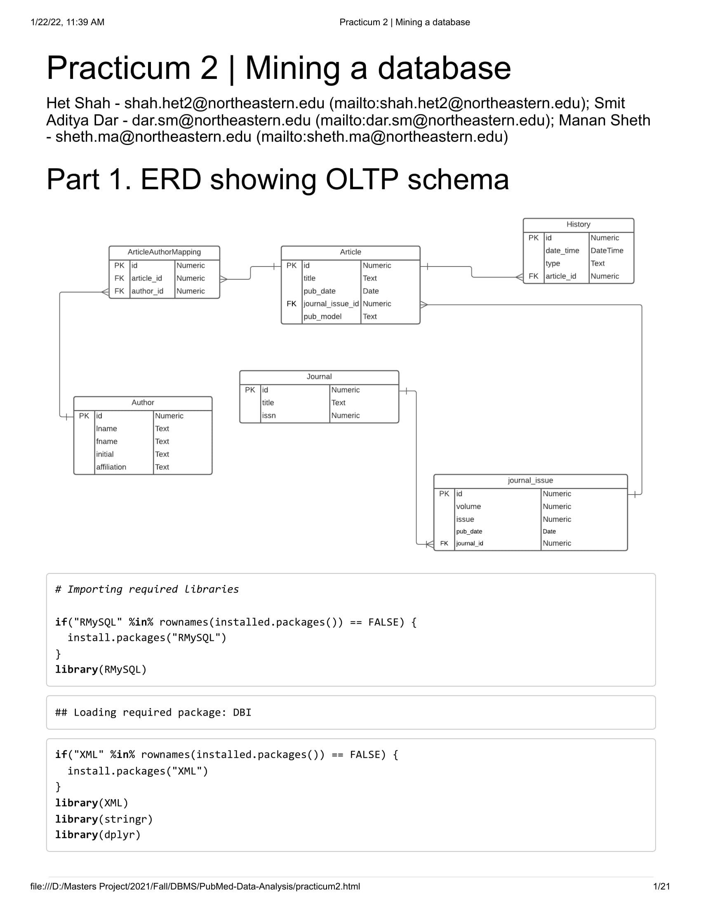
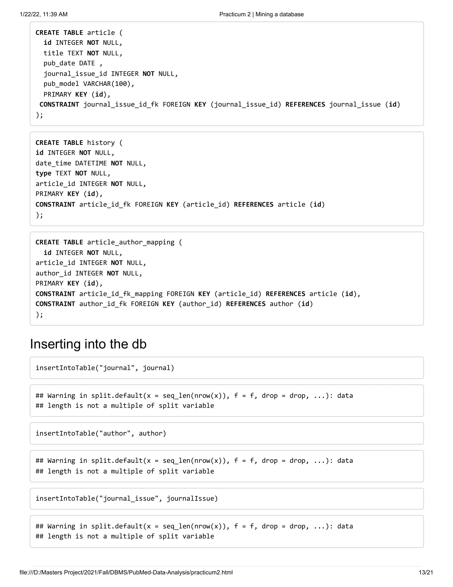
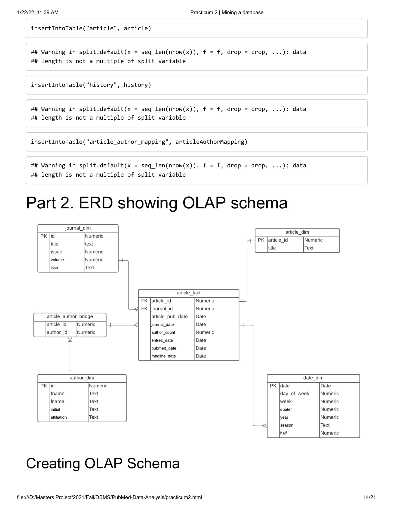
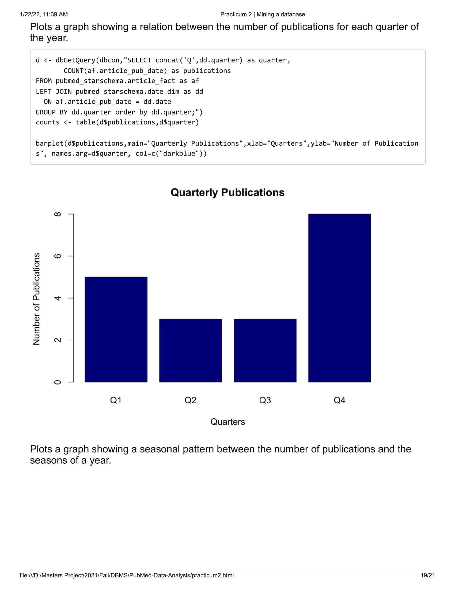
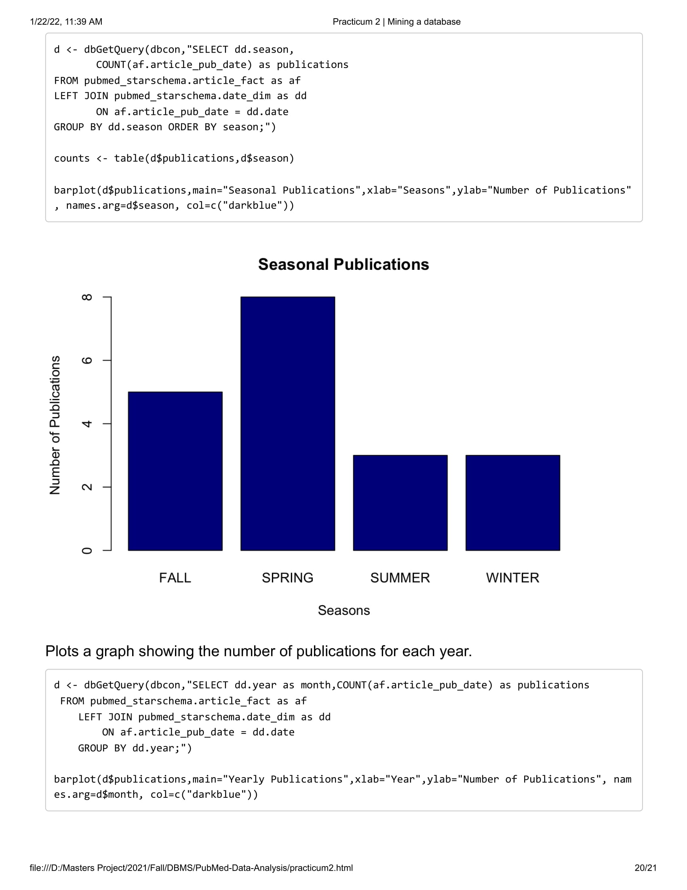
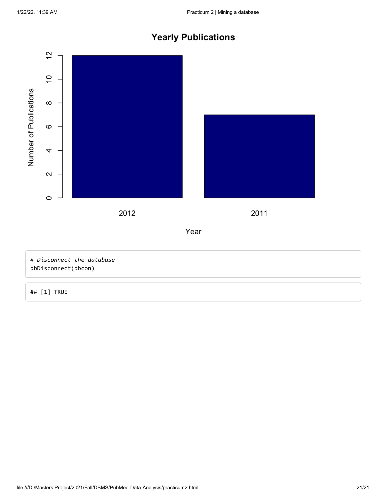

A 'R' project, which cleans data from XML, stores it in a relational database, extracts this processed data and loads it into a Data Warehouse following a snowflake schema.

## 1. ERD for relational schema

## 2. Data cleaning

## 3. Creating OLTP Database and inserting data

## 4. OLAP Schema

## 5. Performing analysis on OLAP database and visualizing them as graphs

