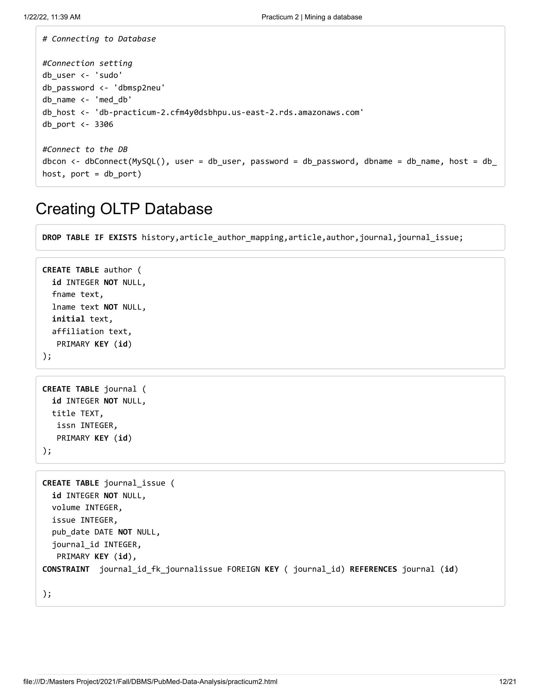

A 'R' project, which cleans data from XML, stores it in a relational database, extracts this processed data and loads it into a Data Warehouse following a snowflake schema.

## ERD for relational schema

## Data cleaning

## Creating OLTP Database and inserting data

## OLAP Schema

## Performing analysis on OLAP database and visualizing them as graphs

